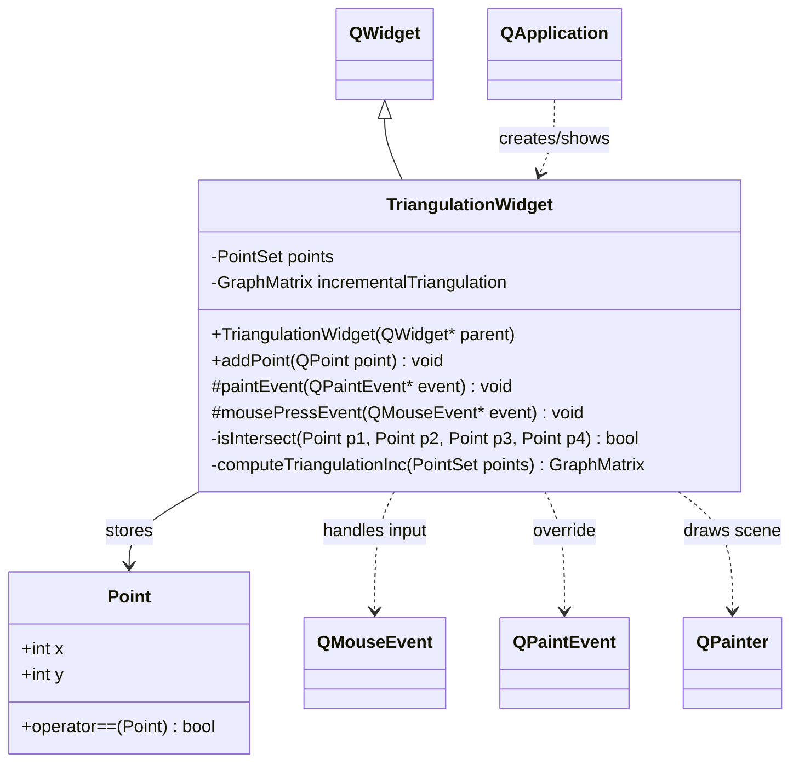

# Triangulation

Qt5/C++ desktop application for 2D triangulation visualization.

## Architecture

The application has a small single-window architecture:

- `main.cpp` creates `QApplication`, instantiates `TriangulationWidget`, and starts the Qt event loop.
- `TriangulationWidget` handles user interaction, rendering, and triangulation logic.
- Left mouse clicks add points; each click recomputes triangulation incrementally.
- Triangulation data is stored as an adjacency list (`GraphMatrix`) and rendered as blue edges.

Flow:

1. User clicks in the widget.
2. `mousePressEvent()` calls `addPoint()`.
3. `addPoint()` updates point storage and calls `computeTriangulationInc()`.
4. `update()` triggers `paintEvent()` to redraw points and edges.

## Class Dependency Diagram



## Requirements

- Linux
- `g++` with C++17 support
- `make`
- Qt5 development packages (`QtWidgets`, `QtGui`, `QtCore`)
- `moc` (Meta-Object Compiler, usually installed with Qt5 tools)

## Build

From the project directory:

```bash
make
```

## Run

```bash
./triangulation
```

`triangulation` is a launcher script generated by the `makefile`.
It starts `triangulation.bin` with a clean runtime environment to avoid
Snap/Conda library conflicts.

## Clean

```bash
make clean
```

## Debug (VS Code + gdb)

- Use `F5` and select `Debug triangulation (make + gdb)`.
- Build task and debugger config are in `.vscode/tasks.json` and `.vscode/launch.json`.

## Demo Video

https://github.com/user-attachments/assets/20aabe1d-5746-471a-91d7-7ae463a0dc03

## Troubleshooting

- If Qt plugin errors appear (`xcb`), rebuild and run through the launcher:

```bash
make clean
make
./triangulation
```

- Confirm Qt plugin path exists on your system:

```bash
ls /usr/lib/x86_64-linux-gnu/qt5/plugins/platforms
```
